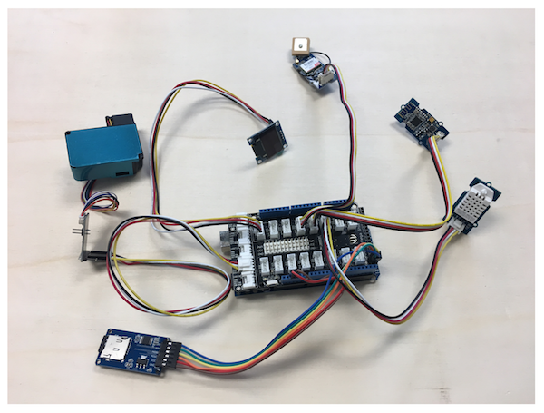

# Hardware

This is the hardware page of the [AirCitizen](http://www.aircitizen.org) project. 

### standalone mobile station

We developped this station for the Cité des sciences et de l'industrie and the turfu workshops.

1. arduino mega board
2. battery
3. grove mega shield
4. grove GPS
5. grove temperature and humidity sensor (DHT22)
6. PM sensor Plantower PMS3003 (non grove) with 4-pin adaptor and grove cable
7. I2C OLED display
8. uSD card reader/writer (non grove) with 8Go SD card

The station can be assembled by connecting the various components to the shield using grove cable. The SD reader/writer is the exception. It uses the SPI protocol to communicate with the MEGA and must be connected to the Arduino using jumper cables.

### fixed station (requires power supply and wifi)

We adapted the [Luftdaten](https://luftdaten.info/) to include a noise sensor for a deployment in the north of Paris. 

# Bill of Materials
### fixed station rev 1

Component Refs | Type            | Value      | Package | Qty | Supplier #
-------------- | --------------- | ---------- | ------- | :-: | ------------
MCU            | NodeMCU         | -          | -    |  1  | [Amazon](https://www.amazon.fr/ESP8266-nodeMCU/s?k=ESP8266+nodeMCU)
SDS011         | SDS011 dust sensor | -       | -    |  1  | -